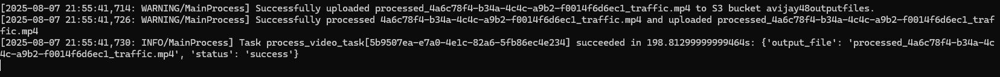

# Traffic Object Detection API

This project provides a FastAPI-based API to process videos for object detection using YOLOv5 and Celery.


## Prerequisites

Before you begin, ensure you have the following installed:

*   **Python 3.11**
*   **Redis:** A running Redis instance is required for Celery's message broker and backend.
*   **AWS CLI:** Configured with your AWS credentials (`aws configure`). The application needs permissions to read from and write to the specified S3 buckets.

## Installation

1.  **Clone the repository:**
    ```bash
    git clone <your-repository-url>
    cd Traffic-Object-Detection-
    ```

2.  **Install the required Python packages:**
    ```bash
    pip install -r requirements.txt
    ```

## Running the Application

You will need to run three separate processes in three different terminals from the project root directory (`C:\User\Traffic-Object-Detection-`).

### 1. Start Redis

Ensure your Redis server is running. If you installed it locally, you can typically start it with:
```bash
redis-server
```

### 2. Start the Celery Worker

In a new terminal, start the Celery worker. The `--pool=solo` flag is required for compatibility with Windows.
```bash
celery -A traffic_detection.API.celery_app worker --loglevel=info --pool=solo
```

### 3. Start the FastAPI Application

In another new terminal, start the FastAPI application using Uvicorn.
```bash
uvicorn traffic_detection.API.app:app --host 127.0.0.1 --port 8000
```
The API will now be running at `http://127.0.0.1:8000`.

## Testing with Postman

You can test the API by sending a video file through Postman.

1.  **Create a new request:**
    *   **Method:** `POST`
    *   **URL:** `http://127.0.0.1:8000/process-video/`

2.  **Configure the request body:**
    *   Select the **Body** tab.
    *   Choose the **form-data** option.
    *   In the `KEY` column, enter `file`.
    *   In the `VALUE` column, click the dropdown and select **File**.
    *   Click **Select Files** and choose a video file (e.g., a `.mp4` file) from your local machine.

     <!-- You can replace this with an actual screenshot if you wish -->

3.  **Send the request.**

### Expected Response

If the request is successful, you will receive a JSON response similar to this:

```json
{
    "message": "File uploaded and processing job has been queued.",
    "input_file": "c8a1b2c3-d4e5-f6a7-b8c9-d0e1f2a3b4c5_your_video_name.mp4",
    "task_id": "a1b2c3d4-e5f6-a7b8-c9d0-e1f2a3b4c5d6",
    "output_s3_url": "s3://avijay48outputfiles/processed_c8a1b2c3-d4e5-f6a7-b8c9-d0e1f2a3b4c5_your_video_name.mp4"
}
```

The processed video will be available at the `output_s3_url` once the Celery task is complete.

## ScreenShots





